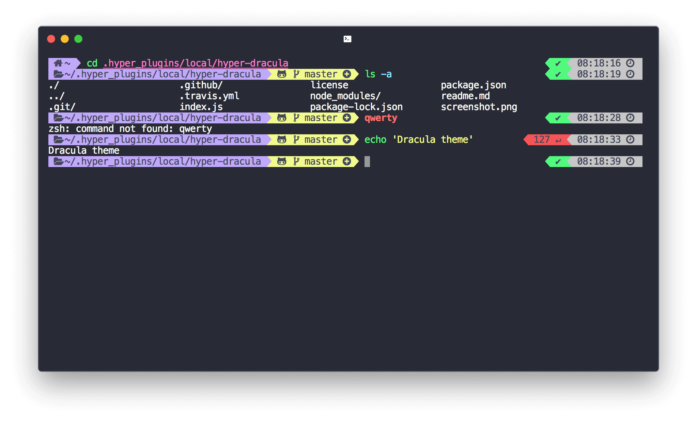

# hyperterm-dracula

[](https://travis-ci.org/dangvanthanh/hyperterm-dracula)

> Dark dracula [HyperTerm](https://hyperterm.org/) theme



## Install

Add `hyperterm-dracula` to the plugins list in your `~/.hyperterm.js` config file.

```
plugins: [
	"hyperterm-dark-dracula"
],
```

## License

MIT © [Dang Van Thanh](http://dangthanh.org)
